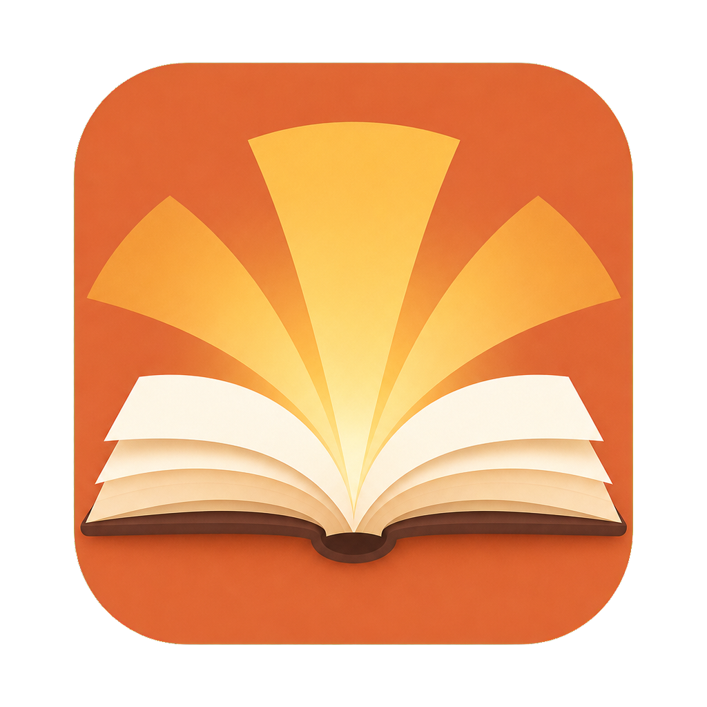

# Lumina



**Lumina · 本地学习流程教练**，开源项目标识为 `lumina-study-coach`。当前第一版已覆盖课程结构、按小节创建每日学习记录、六步固定学习流程、内置 AI 协作、结构化练习与错题、小节笔记和 Markdown 导出。每日记录与小节完成相互独立：每天完成回顾、学习、重构、练习、批改和收尾，小节学完后再整理笔记并标记完成。

AI 协作不要求项目保存 OpenAI 或 Gemini API Key：

- Codex 主流程通过本机 Codex CLI 的 App Server 和官方 ChatGPT OAuth 登录完成。
- Gemini 笔记润色通过官方 Antigravity CLI 和 Google 账号登录完成。
- Codex 默认使用 GPT-5.5 通用模型和 `Medium`，可在设置中从当前账号实时可用的模型与思考强度中切换；不可用时明确提示，不静默回退。
- Antigravity 默认使用 `Gemini 3.5 Flash (High)`，可在设置中从 CLI 实时返回的 Gemini 模型与思考强度中切换。
- 每次生成创建独立会话，并读取课程与小节学习记忆；不会复用上一节聊天历史。
- 已生成的提示词仍可查看和复制，作为未登录或 CLI 不可用时的手动回退。

课程可以保存 PDF、网页 URL 或带字幕的公开视频参考材料。材料按课程、章节或小节持续生效，并通过设置页的材料库弹窗统一筛选和管理。进入每日学习记录后可以选择是否参与本节后续 AI 处理并填写本次页码或范围。PDF、网页正文和视频字幕会保存在本机运行目录中；Codex 为每个小节建立只读完整材料基座，各流程节点从基座 fork 独立任务，避免重复读取。新增材料或扩大范围会增量更新，刷新、替换、删除、停用或缩小范围会重建基座；历史学习记录仍引用当时的材料版本。

每日练习固定生成 12 道结构化题，其中 4 道为选择题。页面一次展示一题，切换题目前保存当前答案；全部完成后整组提交并由 Codex 一次返回逐题批改结果。

设置页只显示材料库入口，点击后在站内大尺寸弹窗中统一筛选和管理材料。Codex 与 Antigravity 均可从本工具断开；Antigravity 的“断开”只停止本工具使用现有登录，不删除 Google 账号的官方登录状态。

应用内置一份基于 MIT OpenCourseWare 18.06 Lecture 1 真实公开材料生成的只读完整示例，可从课程页或首次设置页打开。示例展示六步流程、12 道练习与逐题批改、跨日衔接和最终 Obsidian Markdown 笔记；它不写入数据库、不调用模型，也不进入课程统计、搜索或导出。材料来源和 CC BY-NC-SA 4.0 说明见示例页及 [验收记录](docs/real-example-acceptance.md)。

项目代码使用 [Apache License 2.0](LICENSE)。内置 MIT OpenCourseWare 示例单独按 CC BY-NC-SA 4.0 提供，完整边界见 [第三方声明](THIRD_PARTY_NOTICES.md)。

## 环境要求

- Node.js 22.12 或更高版本
- npm 11
- Python 3.12
- uv 0.11 或更高版本
- Codex CLI（ChatGPT 内置协作）
- Antigravity CLI（可选，仅用于 Gemini 笔记润色）

## 安装

首次使用时，在资源管理器中双击根目录的 `install-local.cmd`。安装/修复程序会：

1. 检查 uv、Node.js 和 npm；缺失时先征求确认，再尝试通过 WinGet 安装。
2. 优先复用现有 Python 3.12 虚拟环境，其次使用系统 Python 3.12，均不存在时再由 uv 安装。
3. 按锁文件同步前后端依赖并生成生产构建。
4. 使用 Lumina 自定义图标，在当前用户桌面创建“Lumina”，并在开始菜单创建启动、停止和卸载入口；升级时清理旧品牌快捷方式。
5. 在数据库迁移前创建包含 SQLite 数据库和本地材料的完整归档，默认最多保留最近 5 份。
6. 仅在全新数据库首次安装时打开首次设置；修复或升级不会重复显示，也不会删除学习数据。

首次设置页可以先打开只读完整示例了解流程。安装器不会向数据库创建示例课程；示例是随前端构建提供的静态内容。

安装窗口只在安装或修复期间显示。完成后，日常使用直接双击桌面的“Lumina”：启动器会在普通用户权限下隐藏启动 FastAPI，等待健康检查通过，再打开 `http://127.0.0.1:8000/courses`。重复双击只会打开页面，不会创建第二个服务进程。

设置页的“本地服务”可以安全关闭桌面启动的服务。关闭浏览器不会自动停止后端，避免中断仍在运行的生成任务；也可以从开始菜单使用“停止 Lumina”。

源码开发者也可以手动安装前端依赖：

```powershell
cd frontend
npm ci
```

以及后端依赖：

```powershell
cd backend
uv sync --locked
```

如需覆盖本地服务配置，可将 `backend/.env.example` 复制为 `backend/.env`。服务默认且应当只监听 `127.0.0.1`。

FastAPI 启动时会通过 Alembic 将数据库升级到当前版本。默认数据库位于被忽略的 `runtime-data/learning-flow-coach.db`，不会进入仓库。

所有修改本地数据的 API 都校验浏览器来源：同源页面和不携带浏览器来源头的本机启动器可用，跨站或 `null` 来源写请求返回 403。服务仍只监听 `127.0.0.1`，该校验不代替本机监听边界。

桌面服务把轮转日志写入被忽略的 `runtime-data/logs/server.log`，PID 写入 `runtime-data/service.pid`，安装前完整归档写入 `runtime-data/backups/`。日志不记录学习正文、提示词、材料全文或模型回答。为兼容已有安装，数据库文件名和浏览器本地存储键继续保留 `learning-flow-coach` 内部前缀；品牌改名不会创建新数据库或丢失界面偏好。

## 备份与恢复

备份归档命名为 `lumina-backup-日期-时间.zip`，包含数据库、上传的 PDF、网页快照和字幕等本地材料；不包含模型登录状态、日志、PID、其他备份或 Obsidian Vault。归档带有文件大小和 SHA-256 清单，恢复前会验证清单、路径、数据库完整性和外键。安装/升级保留 `runtime-data/backups/` 中最近 5 份；完整卸载前的最终归档默认保存在“文档/Lumina Backups”。

恢复时先从设置或开始菜单停止 Lumina，再双击根目录的 `restore-local.cmd`，选择归档并按提示输入 `RESTORE`。恢复只替换数据库和材料目录，保留日志与模型登录状态；校验或写入失败时不会留下部分恢复结果，并会回滚原数据。

## 卸载

可以从开始菜单使用“卸载 Lumina”，或双击根目录的 `uninstall-local.cmd`。源码型卸载提供三个范围：

1. 默认只移除桌面和开始菜单入口，保留学习数据和运行环境。
2. 清理 `.venv`、`node_modules` 和前端构建，保留 `runtime-data` 学习数据。
3. 清理生成环境和 `runtime-data` 本地学习数据；必须连续两次明确确认，默认在“文档/Lumina Backups”创建最后一份数据库与材料完整归档。

卸载器使用固定路径白名单，不删除项目源码，也不扫描或删除 Obsidian Vault。只需要清理新旧快捷方式时，可以运行 `launcher/remove-shortcuts.ps1`。

## AI 登录

AI 子进程需要普通用户权限。日常应从桌面快捷方式启动；不要从 Codex、受限沙箱或其他自动化工具中长期启动本服务。根目录的 `start-local.cmd` 作为诊断入口保留，它会显示终端并要求窗口保持打开。

启动应用后进入“设置 → 模型连接”：

1. 点击“连接 Codex”，在浏览器中完成 ChatGPT 账号授权。
2. 点击“连接 Antigravity”，在打开的 Antigravity 窗口中完成 Google 官方登录。应用会自动检查登录状态并关闭登录窗口，不需要手动退出 CLI。

Codex 的专用登录状态保存在被忽略的 `runtime-data/ai/codex-home`。Gemini 登录状态由 Antigravity CLI 自己管理。两者都不会写入仓库。

桌面启动器、安装器和 `start-local.cmd` 都会从当前 Windows 用户环境重新读取代理配置，避免已经运行较久的终端把过期代理传给本地服务。修改用户级代理后，应完全退出并重新打开原有终端或 Codex Desktop，使旧进程丢弃继承的环境变量。

## 开发模式

终端一：

```powershell
cd backend
uv run uvicorn app.main:app --reload --host 127.0.0.1 --port 8000
```

终端二：

```powershell
cd frontend
npm run dev
```

访问 `http://127.0.0.1:5173/courses`。Vite 会将 `/api` 请求代理到 FastAPI。

## 生产构建

```powershell
cd frontend
npm run build
cd ../backend
uv run uvicorn app.main:app --host 127.0.0.1 --port 8000
```

访问 `http://127.0.0.1:8000/courses`。FastAPI 会提供构建产物，并将未知的前端路由回退到 `index.html`。

## 数据库迁移

```powershell
cd backend
uv run alembic upgrade head
uv run alembic check
```

应用不会通过 SQLAlchemy `create_all` 自动改表，所有 schema 变化都必须提交 Alembic migration。

## 当前功能边界

- 支持闭卷回忆、看课/阅读、主动重构、应用内 AI 出题与作答、AI 批改与纠错，以及今日完成。
- 支持保存最近学习记录、提示词、AI 反馈、整次题目和答案。
- 支持明日预习问题、结构化错题、按课程层级筛选与基础汇总。
- 支持课程级、章节级和小节级学习记忆；完成今日学习时由一次 Codex 任务同时生成每日摘要并更新章节/小节记忆，也可手动重新整理。
- 支持 GPT 生成小节笔记初稿，再由 Gemini 润色。
- 支持在设置中维护学习者背景，并在显式完成课程后把课程学习成果加入后续上下文。
- Codex 任务默认允许网络访问，但本地材料和项目目录保持只读；网络补充必须与材料事实明确区分。
- 支持课程、章节和小节范围的 PDF、网页和公开视频字幕材料，本地保存版本快照、提取文本并按节点加入相关 AI 上下文。
- 支持在每日记录中选择本节使用的材料和具体页码、章节或范围。
- 支持 Obsidian 小节笔记编辑、工具管理范围内的笔记搜索，以及可选择课程和内容的分层 Markdown ZIP 导出。
- 不直接调用模型 API，不自动化 ChatGPT/Gemini 网页，不索引整个 Obsidian Vault，也不提供复杂统计图表。

## 检查

```powershell
cd frontend
npm run check

cd ../backend
uv run ruff check .
uv run pytest
uv run alembic check
```

## 数据边界

仓库不提交 `.env`、虚拟环境、构建产物、数据库、上传材料、网页快照、本地学习数据或个人绝对路径。后续阶段产生的本地数据也必须继续遵守此边界。
