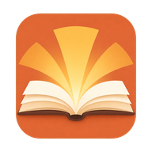
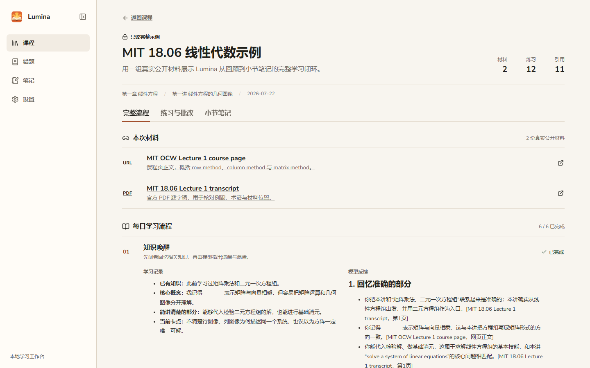

<p align="center">
  
</p>

<h1 align="center">Lumina</h1>

<p align="center">本地优先、围绕主动学习流程设计的学习教练。</p>

<p align="center">
  <a href="README.md">English</a> · <a href="README.zh-CN.md">简体中文</a>
</p>

<p align="center">
  <a href="https://github.com/Throb7777/lumina-study-coach/releases/latest"></a>
  <a href="https://github.com/Throb7777/lumina-study-coach/actions/workflows/ci.yml"></a>
  <a href="LICENSE"></a>
  
</p>

> **公开预览版：** Lumina v0.1.0 是首个 Windows 公开版本。

Lumina 把课程整理为章节、小节和连续的学习记录。每次学习围绕闭卷回顾、学习、
主动重构、练习、批改纠错和下次问题展开；学完小节后，再把最终笔记保存为普通
Markdown 文件并交给 Obsidian 管理。

<p align="center">
  
</p>

## 下载

从 [GitHub Releases](https://github.com/Throb7777/lumina-study-coach/releases/latest)
下载 `install_Lumina-0.1.0.exe`。安装包已经包含 Web 应用、本地服务和
Python 运行时，普通使用不需要另外安装 Node.js 或 Python。

当前预览版尚未进行代码签名，Windows SmartScreen 可能要求手动确认。
安装前可以使用 Release 页面提供的 SHA-256 校验文件核对安装包。

## 主要功能

- 按“课程 → 章节 → 小节”组织学习。
- 每次继续小节时创建一条独立学习记录。
- 引导完成回顾、主动重构、练习、纠错和下次问题。
- 一次生成 12 道结构化练习，支持逐题作答与逐题查看批改。
- 保存错题、学习记忆和可搜索的小节笔记。
- 导入 PDF、网页，以及受支持的公开视频字幕。
- 将最终笔记保存到 Obsidian 的 `课程/章节/小节.md`。
- 课程、材料、配置和索引均保存在本机。
- 内置一份只读示例，可直接查看完整学习流程。

## AI 功能不是必需项

Lumina 不要求填写 OpenAI 或 Gemini API Key。

- 学习流程中的 Codex 任务使用本机 Codex CLI 和官方 ChatGPT 登录。
- Gemini 笔记润色使用本机 Antigravity CLI 和官方 Google 登录。
- 实际可选模型取决于账号权限和服务提供方。
- 外部 CLI 不可用时，仍可查看和复制系统生成的提示词。

课程管理、手动学习记录、材料、笔记、搜索和导出仍然是本地功能。
连接方法和限制见 [AI 连接说明](docs/AI_CONNECTIONS.md)。

## 快速开始

1. 安装 Lumina，并从桌面或开始菜单启动。
2. 在首次欢迎框中点击“开始使用”。
3. 查看内置示例，或者创建一门课程及第一个小节。
4. 根据需要添加 PDF 或 URL 材料。
5. 创建学习记录并完成当天流程。
6. 需要整理小节笔记时，再在设置中选择 Obsidian Vault。

Lumina 只监听 `127.0.0.1`。关闭浏览器不会终止仍在生成的任务；可以从设置或
开始菜单安全停止本地服务。

## 本地数据与隐私

程序文件和学习数据相互独立：

- 程序文件：安装器中选择的目录。
- 学习数据：`%LOCALAPPDATA%\Lumina`。
- Obsidian 笔记：用户选择的 Vault。

Lumina 不包含统计分析或遥测。只有用户主动发起 URL 下载、外部 CLI 登录、
AI 任务、OCR 安装或语义模型下载时才会访问网络。完整说明见
[数据与隐私](docs/DATA_AND_PRIVACY.md)。

默认卸载会保留学习数据。选择同时删除数据时，需要两次确认，并且会先创建最终备份。

## 从源码构建

开发环境需要 Node.js 22.12+、npm 11+、Python 3.12 和 uv 0.11+。

```powershell
cd frontend
npm ci
npm run check

cd ../backend
uv sync --locked
uv run ruff check .
uv run pytest
uv run alembic upgrade head
uv run alembic check
```

Windows 下安装 Inno Setup 6 后，运行 `build-installer.cmd` 可以生成自包含安装包。
更多信息见 [开发与构建](docs/DEVELOPMENT.md)。

## 当前边界

Lumina v0.1.0 是本地单用户 Windows 应用。当前不提供云同步、多用户协作、
移动端专项界面、ChatGPT/Gemini 网页自动控制或整个 Obsidian Vault 索引。
外部 AI 功能也会受到 CLI 版本、账号权限和服务状态影响。

## 参与开发与安全报告

提交代码前请阅读 [CONTRIBUTING.md](CONTRIBUTING.md)。安全问题请按照
[SECURITY.md](SECURITY.md) 私下报告，不要直接创建公开 Issue。

## 许可证

Lumina 源代码使用 [Apache License 2.0](LICENSE)。内置 MIT OpenCourseWare
示例单独使用 CC BY-NC-SA 4.0。依赖和打包资源保留各自许可证，详见
[THIRD_PARTY_NOTICES.md](THIRD_PARTY_NOTICES.md)。
